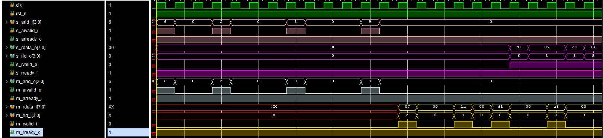

# Потоковый реордер буффер

**Цель проектирования:** Устройство является посредником в обемене между двумя устройствами. Его задача переупорядочивать пакеты данных, отправляемых одним устройством, в зависимости от потока пакетов с ID, задаваемого другим потоком.

## Идея
 * Для хранения ID с сохранением порядка их прихода в модуль используется FIFO.  
  Было решено использовать не просто FIFO, а **FIFO Show Ahead**. Такой модифицировынный буфер FIFO дает возможность обратиться к первому слову данных, не производя операцию чтения. Когда приходят пакеты с ID для начала нужно произвести сравнение пришедшего ID и ID, который хранится в FIFO. При использовании обычного FIFO пришлось бы прочитать ID с помощью сигнала ```pop```. Но при использовании Show Ahead можно произвести операцию сравнения сразу же, на том же такте.
  * Для хранения пакетов с ID, которые не прошли первое сравнение, временно помещаются в RAM и ожидают, когда из FIFO выйдет нужный ID.

## Алгоритм работы
 ### 1. Через порт s_arid_i ID поступают в модуль и сохраняются в FIFO.
 ### 2. Через порты m_rid_i и m_rdata_i данные и ID поступают в модуль от другого устройство. 
 ### 3.  Производится сравнение новопришедшего ID c ID, который уже находится на шине data_o FIFO. Результат сравнения называется id_match1.  
 ```Verilog   
 assign id_match1 = (compare_id == m_rid_i) && m_r_handshake;
 ```
 compare_id — ID, прочитанный из FIFO

 ### 4. Если ID совпадают, то данные вместе с ID сразу же отправляются на выход, а для FIFO генерируется сигнал pop, и на шину data_o выставляется следующий ID.  

 Данные отправятся на выход только при условии высокого уровня сигнала **s_rready_i**
 ```Verilog
  else if (id_match1 && s_rready_i) begin
    s_rid_o    <= m_rid_i;
    s_rdata_o  <= m_rdata_i;
    s_rvalid_o <= m_rvalid_i;
  end
```  
Сигнал **pop** для FIFO генерируется следующим образом
```Verilog
assign pop = ~empty_fifo && (id_match1 || id_match2) && s_rready_i ? 1'b1 : 1'b0;
```
То есть если произошло совпадение ID, FIFO не пустой (на самом деле совпадения не может произойти, если FIFO пустой, поэтому, возможно, это условие избыточно) и принимающее устройство готово (s_rready_i = 1), то произойдет чтение из FIFO.
 
 ### 5. Если ID не совпадают, то производится проверка на наличие слова данных с нужным ID внутри RAM, если такого не найдется, то слово данных записывается в RAM по адресу, равному ID, с которым пришло это слово данных.  
  Для проверки на то, есть ли в RAM слово данных с нужным ID создан специальный регистр:  
  ```Verilog
  logic [15:0] register_of_valid_data_in_ram;
  ```
  Когда происходит запись в RAM, то соответствующий бит регистра становится единицей, при чтении наоборот — нужный бит обнуляется
  ```Verilog
  always_ff @(posedge clk) begin
    if (~rst_n)
      register_of_valid_data_in_ram              <= 16'b0;
    else if (~id_match1 && m_r_handshake) 
      register_of_valid_data_in_ram[m_rid_i]     <= 1'b1;
    else if (id_match2 && s_rready_i)
      register_of_valid_data_in_ram[compare_id]  <= 1'b0;
  end
  ```

  Если совпадения нет, то производим запись в память
  ```Verilog
  always_ff @(posedge clk)
    if (~id_match1 && m_r_handshake)
      ram_for_data[m_rid_i] <= m_rdata_i;
  ```
  
### 6. Если при сравнении ID, найдено совпадение внутри RAM, то на выход отправляются данные из памяти
```Verilog
  else if (id_match2 && s_rready_i) begin
      s_rid_o    <= compare_id;
      s_rdata_o  <= ram_for_data[compare_id];
      s_rvalid_o <= register_of_valid_data_in_ram[compare_id];
  end
```

## Схема разрабатываемого устройства

  

## Пример работы

  

 * AR Slave Interface — розовый цвет
 * R Slave Interface — фиолетовый цвет
 * AR Master Interface — серый цвет
 * R Master Interface — оранжевый цвет


